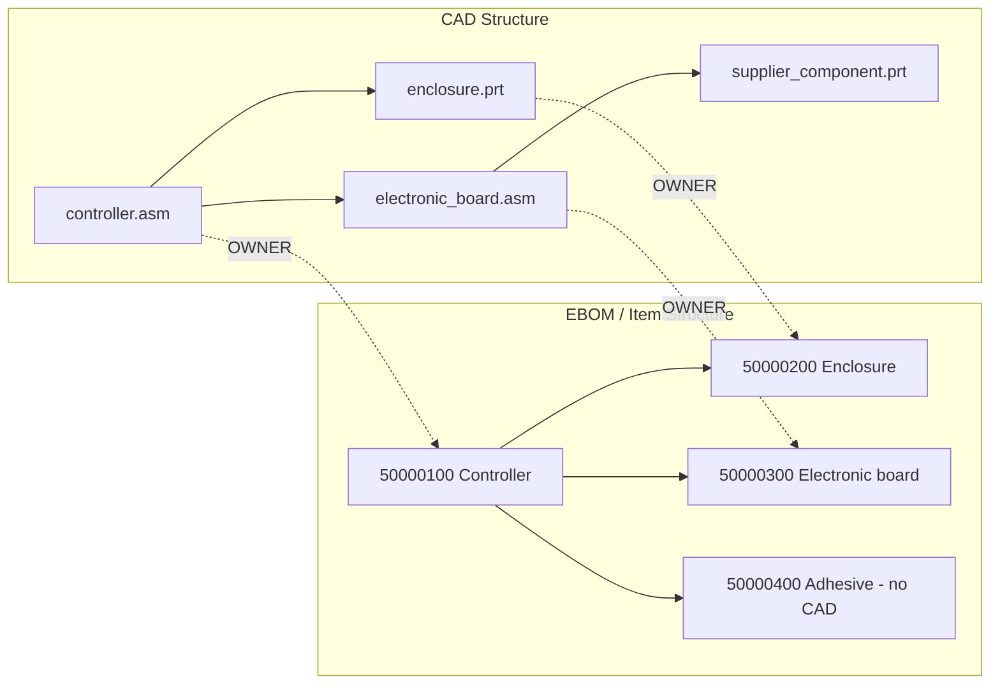

# Nexus PDM - Integrated CAD and EBOM Guide

This guide explains the Nexus PDM architecture and its integrated user
interface. It is the starting point for understanding CAD Documents, Items,
the native CAD structure, the engineering BOM (EBOM), associations, delivery
files, and checkout behavior.

## 1. The short explanation

Nexus manages two independent business objects:

1. A **CAD Document** represents one managed native CAD file, such as a Creo
   `PRT`, `ASM`, or `DRW`.
2. An **Item** represents the real part, purchased article, assembly, material,
   software package, or other object that belongs in the EBOM.

A CAD Document and an Item are not the same object. They are connected by a
typed association.

```text
CAD Document                     Item
--------------------------       --------------------------
primary_wire_60a.prt      ---->  Number 50012456 / AES WR03
w_rig_60_diff_t_n_f.prt   ---->  Number 50012456 / AES WR03
primary_wire_60a.drw       ---->  Number 50012456 / AES WR03
```

The three CAD Documents above describe the same physical Item. Nexus does not
create three EBOM Items.

This is the central separation used by commercial PDM systems such as
Windchill.

### Item identity

Nexus uses the same identity separation as a commercial PDM/PLM system:

| Concept | Nexus storage | Rule |
|---|---|---|
| Internal database key | `bom.id` | Hidden implementation identity |
| Item / PLM Number | `bom.part_number` | Generated, immutable, and unique in a product version; for example `50012456` |
| Delivery reference | `bom.aes_number` | Required only when the Item is deliverable |
| CAD Document Number | `cad_documents.number` | Independent, product-scoped unique CAD identity connected through a typed association |

The user-facing word **Number** always means `bom.part_number` on an Item row.
AES is never used as the PDM Item identity.
CAD Document Numbers commonly retain the native extension, such as
`50012456.PRT` or `50012456.DRW`; their normalized base can still match Item
Number `50012456` during explicit auto-association.

## 2. One workspace, two structure views

The BOM page is the main PDM workspace. Use the structure selector above the
tree to switch between:

- **CAD Structure**: the native CAD assembly and component structure.
- **EBOM / Item Structure**: the independent engineering Item structure.

These are two views of related product information, not two copies of the same
tree.



The supplier component is a valid managed CAD Document without becoming an
EBOM Item. The adhesive is a valid Item even though it has no CAD Document.

The selected row determines which information and actions Nexus displays. Use
the row's context menu for object-specific operations. There is no separate PDM
menu or detached CAD-structure window to navigate for normal work.

## 3. CAD Structure: native CAD data only

The CAD Structure contains managed CAD Documents and their real assembly/member
relationships. It contains native CAD data such as:

- Creo assemblies (`.asm`) and components (`.prt`)
- Simplified or alternate CAD representations
- Skeleton and reference models
- Supplier-controlled internal CAD components
- CAD Documents with no associated Item

A native Creo drawing (`.drw`) is managed CAD data, but it is **not** an
independent structure node. Every drawing is bound to one PRT or ASM model and
is shown in that model's details.

It does **not** contain Item delivery documents or Item health information:

- PDF is not a CAD Structure node or column.
- STEP is not a CAD Structure node or column.
- Item file-integrity and Item-issue indicators are not shown there.

Those belong to the Item and are displayed in **EBOM / Item Structure** and the
Item details panel.

The CAD tree uses CAD-specific columns:

| Column | Meaning |
|---|---|
| CAD Name | Native `.prt` or `.asm` filename, with the CAD icon and expansion arrow |
| Description | Human-readable CAD description |
| Category | Assembly or component |
| Rev/Iter | Independent CAD revision and iteration |
| Lifecycle | CAD lifecycle state |
| Related Item | Associated Item and association type, or Unassociated |
| Checkout | Checked in or the current checkout owner |
| Build | Included in or excluded from CAD-to-EBOM build |
| Qty | Quantity of this CAD occurrence in its parent assembly |

An assembly arrow expands only CAD members. Selecting a CAD row opens CAD
Document information, including its related DRW file, in the details area. The
associated Item is shown as a relationship, not inserted as a CAD member.

### Registering a CAD-only Document

Right-click empty space in **CAD Structure** and select **Register CAD
Document...**. Registering a CAD Document does not automatically create an
Item. A registered and unassociated CAD Document is valid and is not an orphan.

To register a drawing, right-click its PRT/ASM row and use **Related Drawing >
Register Related Drawing...**. The drawing is bound to that model and never
becomes a separate root or assembly member. Use **Bind Existing Drawing...** in
the same contextual menu to repair an older unbound managed DRW.

### Editing CAD assembly membership

CAD membership is managed directly in the CAD tree:

1. Right-click an assembly CAD row.
2. Select **Add CAD Component...**.
3. Choose the managed child CAD Document, quantity, and build inclusion.
4. To remove an occurrence, right-click that child and select **Remove from CAD
   Assembly**.

Removing a member removes only the CAD occurrence. The CAD Document remains
managed. Circular CAD structures are rejected.

Changing the CAD tree does not silently rewrite the EBOM. Compare and build the
selected Item structure explicitly when the CAD change must be transferred.

## 4. EBOM / Item Structure

The EBOM contains business Items required for engineering, procurement,
manufacture, assembly, or delivery. It can contain:

- Items associated with CAD Documents
- Purchased Items without CAD
- Packaging, paint, adhesive, software, and documentation
- Manually inserted EBOM children
- Children built from an OWNER CAD structure

Non-deliverable Items remain visible and associable in the authoring Item
Structure. Their delivery policy controls released output and AES validation;
it does not delete or hide the Item master from engineering work.

Every Item row uses an **Item icon**. Every associated CAD row uses a distinct
**CAD icon** based on its CAD category.

Associated CAD Documents are displayed as indented related rows beneath their
Item:

```text
[Item] 50001000  ELECTRONIC UNIT       B.2  Released  PDF OK  STEP OK
    [CAD Assembly] electronic.asm      A.7  OWNER     Checked in
    [CAD Part]     simplified.prt      A.1  IMAGE     Checked in
    [Item] 50001010  ENCLOSURE         A.4  In Work
        [CAD Part] enclosure.prt       A.6  OWNER     Checked in
```

An associated CAD row is not an EBOM usage and does not affect quantity or
level. It is a visible relationship under the Item that it describes. To inspect
its native membership, right-click it and select **Open in CAD Structure**.
Related DRW files are shown in the PRT/ASM details rather than as additional
EBOM CAD rows.

### Item delivery and health information

Item rows keep the existing Vault-style information:

- PDF and STEP indicators
- Revision and lifecycle status
- Integrity status
- Source and effective quantities
- Item issues and warnings
- Associated files, versions, history, and preview in the details panel

Indicator meaning is available through tooltips. A non-deliverable CAD
representation does not receive independent PDF or STEP requirements; those
deliverables belong to the Item.

## 5. Managing CAD-Item associations from the EBOM

Associations are managed in context from the Item and its related CAD rows.
There is no detached association list required for normal work.

### Associate an existing CAD Document

1. Switch to **EBOM / Item Structure**.
2. Right-click the target Item.
3. Open **Associated CAD Documents**.
4. Select **Associate Existing CAD...**.
5. Check one or more managed CAD Documents and choose the association type.
6. Confirm the change.

If the Item is checked in, Nexus asks to check it out first. Association changes
are Item-definition changes; checking out the Item does not check out its other
CAD Documents.

### Register and associate a new CAD Document

Right-click the Item and select:

```text
Associated CAD Documents > Register and Associate CAD...
```

This registers the native CAD file and immediately relates it to the selected
Item.

### Change or remove an association

Right-click the indented CAD child beneath the Item and use:

- **Change Association Type...**
- **Remove Association**

The Item must be checked out. The CAD Document itself must be checked in before
its association can be changed or removed. Removing the association does not
delete the CAD Document; it remains managed and may become CAD-only.

## 6. Association types

Every CAD-to-Item relationship has a type. The type determines what the CAD
Document is allowed to control.

| Association | Drives EBOM structure | Drives Item attributes | Participates in EBOM | Typical use |
|---|---:|---:|---:|---|
| `OWNER` | Yes | Yes | Yes | Main model or assembly |
| `CONTRIBUTING_IMAGE` | No | Yes | Yes | Secondary geometry contributing attributes |
| `IMAGE` | No | No | Yes | Alternate or simplified model |
| `CONTRIBUTING_CONTENT` | No | Yes | No | Secondary CAD contributing attributes |
| `CONTENT` | No | No | No | Drawing or supporting CAD |

Important rules:

- An Item can have only one active `OWNER` CAD Document.
- One Item can have several other CAD Documents.
- A CAD Document can have only one active Item association.
- Only an `OWNER` CAD Document drives the Item's child structure.
- A `CONTENT` CAD Document never creates EBOM children.
- A CAD Document may remain unassociated when no Item is required.

Automatic matching first compares the CAD Document Number with the immutable
Item Number. A legacy filename-base match is used only as an explicit fallback;
AES is not an association identity. Nexus never silently creates hundreds of
Items for supplier files. Ambiguous or conflicting matches require user
resolution in the Item association workflow.

## 7. Example: primary wire and alternate representation

Required result:

```text
[Item] 50012456 - PRIMARY WIRE 60A T N (AES WR03)
|
+-- [CAD Part]    OWNER   primary_wire_60a_t_n.prt
|   +-- [Related DRW]    primary_wire_60a_t_n.drw
+-- [CAD Part]    IMAGE   w_rig_60_diff_t_n_f.prt
+-- [Item file]           primary_wire_60a_t_n.pdf
+-- [Item file]           primary_wire_60a_t_n.step
```

Behavior:

- `WR03` belongs to the Item.
- The alternate representation does not need another AES number.
- The alternate representation does not require its own PDF or STEP.
- The drawing describes the same Item but does not build the EBOM.
- The Item appears only once in the EBOM.

## 8. Example: supplier electronic assembly

Required result:

```text
[Item] 50050100 - Electronic controller (AES-500100)
|
+-- [CAD Assembly] OWNER electronic_controller.asm
    |
    +-- pcb.prt
    +-- resistor_001.prt
    +-- capacitor_001.prt
    +-- connector_001.prt
    +-- hundreds of supplier CAD Documents
```

The internal files are:

- Managed CAD Documents
- Valid CAD members, not orphans
- Build-excluded when they are supplier-controlled
- Related to the supplier Item as `CONTENT` when assigned as supplier
  dependencies
- Not required to have individual AES numbers, drawings, PDFs, or STEP files

Only the electronic controller Item is normally delivered and controlled.

To assign supplier files:

1. Set the owning Item's **CAD Control** to `SUPPLIER PACKAGE`.
2. Open **Diagnostics**.
3. Check the internal supplier CAD files.
4. Select **Assign selected to supplier package**.

Nexus registers them as managed, build-excluded CAD Documents. They no longer
appear as orphans.

## 9. Comparing and building the EBOM from CAD

CAD and Item structures are not synchronized continuously. Start comparison and
build from the Item that owns the CAD assembly:

1. Switch to **EBOM / Item Structure**.
2. Right-click the assembly Item.
3. Open **Item Structure**.
4. Select **Compare with OWNER CAD...**.
5. Review the differences.
6. Select **Build Item Structure from OWNER CAD** when the proposed result is
   correct.

Building changes Item data, so the Item must be checked out. Nexus offers to
check it out when required.

The build:

- Starts from the Item's `OWNER` CAD assembly.
- Reads eligible CAD member links.
- Finds the associated Item for each eligible child.
- Creates or updates CAD-built Item usages.
- Transfers quantity and available occurrence information.
- Preserves manual Item usages.
- Skips build-excluded CAD Documents.
- Reports CAD Documents with no related Item.
- Records a build run and an immutable Item-structure snapshot.

Common comparison statuses:

| Status | Meaning |
|---|---|
| `COMPLETED` | CAD and Item usage agree |
| `TO_BE_BUILT` | Associated CAD member is missing from the Item Structure |
| `UPDATE_REQUIRED` | Quantity or related Item changed |
| `NO_RELATED_ITEM` | CAD Document has no associated Item |
| `NOT_PARTICIPATING` | Association type does not participate in the EBOM |
| `EXCLUDED` | CAD member or Document is excluded from build |
| `NOT_NEEDED_IN_ITEM_STRUCTURE` | Old CAD-built Item usage should be removed on build |

## 10. Adding an Item without CAD

Choose **New Item** without selecting a CAD file. Nexus generates the immutable
Item Number when **Finish** is selected. AES is required when the Item is
deliverable and may be empty for a non-deliverable Item. Software, purchased,
reference, and other non-CAD Items remain normal EBOM Items.

The enterprise Item master form controls Item Type, Assembly Mode, Source,
View, Default Unit, native-CAD requirement, drawing requirement, and supplier
package policy. CAD, native DRW, PDF, and STEP files are managed from the
selected Item's contextual relationship/content actions, not entered as Item
identity fields.

To insert it into an assembly EBOM:

1. Right-click the parent in **EBOM / Item Structure**.
2. Open **Item Structure**.
3. Select **Add Manual Item Usage...**.
4. Choose the child Item and enter its quantity.

The parent Item must be checked out. Manual usages are preserved by later CAD
builds.

Typical Items without CAD include adhesive, paint, packaging, software, bulk
material, and purchased assemblies without internal CAD control.

## 11. Checkout and check-in semantics

Item and CAD working copies are visible and manageable from both structure
views. The command always follows the selected row's object type.

### Checking out an Item

Right-click an Item and select **Check Out Item**.

- Exactly that Item is reserved.
- No associated CAD Document is checked out.
- Item attributes, EBOM usages, associations, and Item delivery documents can
  be changed.
- CAD geometry remains independently controlled.
- Item check-in creates an Item iteration only; it does not check in associated
  CAD Documents.

An Item cannot be checked in or have its checkout undone while an associated
CAD working copy is active. Close the related CAD working copies first.

### Checking out a CAD Document

Right-click a CAD row in either structure and select **Check Out CAD**.

- The selected CAD Document is checked out.
- Its associated Item is checked out automatically to the same user.
- Other CAD Documents associated with that Item remain checked in.
- An unassociated CAD Document is checked out without locking an Item.
- If another user owns the Item lock, the CAD checkout is rejected and no
  partial CAD checkout is left behind.
- If the same user already owns the Item checkout, Nexus reuses that lock.

The automatic Item lock protects the relationship and Item definition while its
CAD is being modified. The Item row and CAD row both display their current
checkout state.

If the user selects **Check Out Item** while the Item has only an automatic
CAD-origin lock, Nexus changes it to an explicit Item checkout. This is shown as
**Make Item Checkout Explicit** in the context menu.

### Checking in or undoing a CAD checkout

**Check In CAD...** requires the native file and a check-in comment. It creates
a new CAD iteration in the current CAD revision. **Undo CAD Checkout** discards
the CAD working state without creating an iteration.

After either operation:

- If another associated CAD Document is still checked out, the Item lock is
  retained for CAD work.
- If the Item was already checked out explicitly, its lock is retained.
- If the Item received independent Item changes, its checkout is retained as an
  explicit Item checkout so no work is discarded.
- If this was the last related CAD working copy and the automatic Item checkout
  is clean, Nexus releases the Item checkout automatically without creating an
  Item iteration.

This prevents harmless CAD-only work from creating empty Item iterations while
preserving every real Item change.

### Released Item rules

A Released Item revision is immutable.

- Checking it out requires a target revision code, such as `B`.
- The Released revision remains the current immutable version during checkout.
- The target revision is pending until the next completed Item commit.
- The completed commit creates the new Item revision at iteration `1`, such as
  `B.1`.
- Undo Checkout restores the Released Item and removes the pending revision.
- A CAD checkout related to a Released Item asks for the target Item revision
  before acquiring the automatic Item lock.

### Released CAD rules

A Released CAD iteration is also immutable.

- It cannot be checked out directly.
- Right-click it and select **Revise and Check Out CAD...**.
- Nexus creates the next CAD revision at iteration `1`, then checks out that new
  revision.
- The older Released CAD revision remains unchanged.

CAD and Item revisions are independent:

```text
Item 50000100:  revision B, Item iteration 3
controller.asm: revision A, CAD iteration 7
```

They do not need the same revision or iteration number.

## 12. Diagnostics and orphan rules

A file is an orphan only when:

```text
the file exists in the working directory
AND no managed CAD Document exists for it
AND it is not a supplier-managed dependency
AND it is not otherwise force-integrated
```

A managed CAD Document without an Item is valid and is not an orphan.

This differs from the old rule where a CAD file usually needed a BOM row to
avoid being reported as an orphan.

## 13. Item release validation

Release validation uses PDM associations:

- A required native CAD definition is satisfied by an associated non-drawing
  CAD Document.
- A required drawing is satisfied by an associated Drawing CAD Document.
- An Item with CAD requirement `OPTIONAL` or `NOT_REQUIRED` may be released
  without CAD when its other rules are satisfied.
- Child validation follows the persisted Item Structure.
- Item PDF, STEP, integrity, and issue rules remain Item-level controls.

## 14. Existing-project migration

The PDM migration is backward-compatible:

- Existing `bom.id` values remain stable as internal keys.
- Existing `bom.part_number` values such as `50012456` remain the Item/PLM Number.
- Existing CAD filenames become managed CAD Documents.
- Existing assembly relationships become CAD member links.
- Existing normal delivery relationships seed the persisted Item Structure.
- Alternate representations become `IMAGE` associations.
- Existing drawings are bound to their owning PRT/ASM model where the legacy
  relationship can be identified unambiguously.
- Supplier dependencies become build-excluded `CONTENT` CAD Documents.
- Existing commits, baselines, revisions, and historical records are retained.

Legacy tables remain available for historical compatibility, but current PDM
work is performed directly in **CAD Structure** and **EBOM / Item Structure** on
the BOM page.

## 15. Main database tables

| Table | Purpose |
|---|---|
| `bom` | Item master; `part_number` is the PLM Number and `id` is internal |
| `item_number_sequence` | Atomic generator for new immutable Item Numbers |
| `cad_documents` | CAD Document master, checkout state, and DRW-to-model binding |
| `cad_document_iterations` | CAD revision/iteration history |
| `cad_document_contents` | Native, secondary, and derived CAD content |
| `cad_document_members` | CAD assembly membership |
| `cad_item_associations` | Typed CAD-to-Item associations |
| `item_usages` | Persisted EBOM parent/child usages |
| `item_occurrences` | Reference designators and occurrence data |
| `item_structure_iterations` | Immutable EBOM structure snapshots |
| `pdm_build_runs` | CAD-to-EBOM build history |
| `pdm_build_results` | Result for every processed CAD member |
| `locks` | Item checkout owner and checkout origin (`ITEM` or `CAD`) |
| `cad_document_checkout_logs` | CAD checkout, check-in, and undo history |

## 16. Recommended daily workflow

For normal CAD-driven design:

1. Open **CAD Structure** and register any unmanaged native CAD Documents.
2. Build the native assembly with **Add CAD Component...** from assembly rows.
3. Switch to **EBOM / Item Structure**.
4. Associate primary models as `OWNER` and alternate models as `IMAGE` from the
   target Item. Register each DRW from its owning PRT/ASM row.
5. Right-click the Item and compare it with its OWNER CAD structure.
6. Resolve CAD members with no related Item by associating them, creating an
   Item when necessary, or leaving/excluding valid CAD-only content.
7. Build the Item Structure from the OWNER CAD.
8. Add non-CAD Items manually.
9. Review Item PDF/STEP indicators, integrity, issues, and release readiness in
   the EBOM and Item details panel.
10. Check in and release Items and CAD Documents according to their independent
    lifecycle rules.

## 17. Verification scope

Automated tests cover:

- Safe and idempotent migration
- CAD-only Documents and Items without CAD
- Association constraints
- Auto-association and build behavior
- Manual EBOM preservation
- CAD/Item comparison
- Circular CAD prevention
- Exact Item-only checkout
- CAD checkout with automatic Item coordination
- Clean automatic Item-lock release
- Multiple CAD working copies for one Item
- Released Item pending-revision behavior
- Released CAD revise-before-checkout behavior
- Item Structure snapshots and export
- Supplier package and orphan behavior
