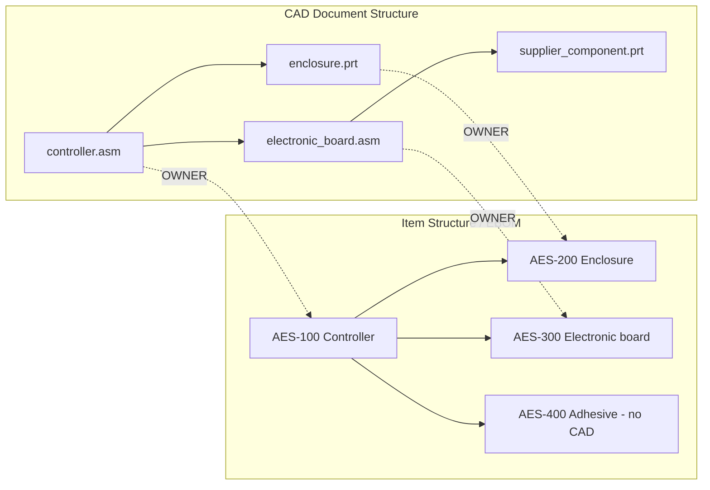

# Nexus PDM - User and Technical Guide

This document explains the PDM changes in practical terms. It is the starting
point for understanding the difference between CAD files, Items, the CAD
structure, and the engineering BOM (EBOM).

## 1. The short explanation

Nexus now manages two different business objects:

1. A **CAD Document** represents one managed CAD file, such as a Creo `PRT`,
   `ASM`, or `DRW`.
2. An **Item** represents the real part, purchased article, assembly, material,
   software package, or other object that belongs in the EBOM.

A CAD Document and an Item are not the same object. They are connected by an
association.

This is the central idea used by Windchill PDM.

```text
CAD Document                     Item
--------------------------       --------------------------
primary_wire_60a.prt      ---->  AES WR03
w_rig_60_diff_t_n_f.prt   ---->  AES WR03
primary_wire_60a.drw       ---->  AES WR03
```

The three CAD Documents above describe the same physical Item. Nexus does not
create three EBOM Items.

## 2. The two structures

Nexus now separates the two product structures.



The supplier component remains a valid managed CAD Document, but it does not
have to become an EBOM Item. The adhesive is a valid Item even though it has no
CAD file.

### CAD Document Structure

The CAD structure contains every managed CAD file and its CAD assembly
relationships. It can contain:

- Deliverable models
- Assemblies and components
- Drawings
- Simplified representations
- Skeleton and reference models
- Supplier-controlled internal components
- CAD Documents with no associated Item

Open it from:

```text
BOM page > PDM > CAD Document Structure...
```

### Item Structure / EBOM

The Item Structure contains the business Items required for engineering,
procurement, manufacture, assembly, or delivery.

It can contain:

- Items created from CAD
- Purchased Items without CAD
- Packaging, paint, adhesive, software, and documentation
- Manual EBOM children
- CAD-built children

Select **Item Structure** from the structure selector on the BOM page.

## 3. CAD-to-Item association types

Every CAD-to-Item relationship has a type. The type determines what the CAD
Document is allowed to control.

| Association | Drives EBOM structure | Drives Item attributes | Participates in EBOM | Typical use |
|---|---:|---:|---:|---|
| `OWNER` | Yes | Yes | Yes | Main model or assembly |
| `CONTRIBUTING_IMAGE` | No | Yes | Yes | Secondary geometry contributing attributes |
| `IMAGE` | No | No | Yes | Alternate or simplified model |
| `CONTRIBUTING_CONTENT` | No | Yes | No | Secondary CAD contributing attributes |
| `CONTENT` | No | No | No | Drawing or supplier-owned supporting CAD |

Important rules:

- An Item can have only one active `OWNER` CAD Document.
- One Item can have several other CAD Documents.
- A CAD Document can have only one active Item association.
- Only an `OWNER` CAD Document drives the Item's child structure.
- `CONTENT` Documents never create EBOM children.

Manage associations from:

```text
BOM page > select an Item > PDM > CAD-Item Associations...
```

## 4. Example: primary wire and alternate CAD representation

Required result:

```text
Item WR03 - PRIMARY WIRE 60A T N
|
+-- OWNER   -> primary_wire_60a_t_n.prt
+-- IMAGE   -> w_rig_60_diff_t_n_f.prt
+-- CONTENT -> primary_wire_60a_t_n.drw
+-- Derived -> primary_wire_60a_t_n.pdf
+-- Derived -> primary_wire_60a_t_n.step
```

Behavior:

- `WR03` belongs to the Item.
- The alternate CAD representation does not need another AES number.
- The alternate representation does not require its own PDF or STEP.
- The drawing describes the same Item but does not build the EBOM.
- The Item appears only once in the EBOM.

## 5. Example: supplier electronic assembly

Required result:

```text
Item AES-500100 - Electronic controller
|
+-- OWNER -> electronic_controller.asm
    |
    +-- pcb.prt
    +-- resistor_001.prt
    +-- capacitor_001.prt
    +-- connector_001.prt
    +-- hundreds of supplier CAD Documents
```

The internal files are:

- Managed CAD Documents
- Not orphans
- Build-excluded
- Associated with the supplier Item as `CONTENT` when assigned as supplier
  dependencies
- Not required to have individual AES numbers, drawings, PDFs, or STEP files

Only the electronic controller Item is normally delivered and controlled.

To assign supplier files:

1. Set the owning assembly's **CAD Control** to `SUPPLIER PACKAGE`.
2. Open **Diagnostics**.
3. Check the internal supplier files.
4. Click **Assign selected to supplier package**.

Nexus registers them as managed, build-excluded CAD Documents. They no longer
appear as orphans.

## 6. Registering a CAD file without creating an Item

Use this when a valid CAD file must be managed but should not enter the EBOM.

1. Open the BOM page.
2. Select **PDM > Register CAD Document...**.
3. Select the Creo file.
4. Enter the CAD Document number and name.
5. Leave it unassociated, or associate it later as `IMAGE` or `CONTENT`.

The file is now managed. Diagnostics will not report it as an orphan.

Registering a CAD Document does not automatically create an AES Item.

## 7. Creating or editing the CAD structure

Open:

```text
PDM > CAD Document Structure...
```

The window shows:

- CAD number
- Filename
- Category
- Association type
- Revision and iteration
- Lifecycle state
- Checkout owner
- Quantity
- Build inclusion state

To add a CAD member:

1. Select a parent assembly.
2. Select the child CAD Document.
3. Enter the quantity.
4. Optionally check **Exclude this CAD member from Item Structure build**.
5. Click **Add or update CAD member**.

Circular CAD structures are rejected.

Removing a CAD member does not silently rewrite the EBOM. The compare operation
reports that the old Item usage is no longer needed; the next explicit build
removes the CAD-built usage.

## 8. Auto Associate

Open:

```text
PDM > Auto Associate CAD Documents
```

Nexus compares the CAD number and filename with existing Item AES numbers, part
numbers, and known CAD bases.

Possible results:

- `MATCH`: exactly one Item was found and can be associated.
- `NO_MATCH`: no Item was found; the CAD Document can remain CAD-only.
- `AMBIGUOUS`: more than one Item matched; the user must choose.
- `BUILD_EXCLUDED`: no automatic OWNER association is proposed.
- `CONFLICT`: the proposed Item already has an OWNER CAD Document.

Auto Associate never silently creates hundreds of Items for supplier files.

## 9. Building the Item Structure from CAD

The CAD and Item structures are not synchronized continuously. The user starts
an explicit build, like in Windchill.

1. Select the assembly Item.
2. Select **PDM > Compare CAD to Item Structure...**.
3. Review the differences.
4. Select **PDM > Build Item Structure from CAD**.
5. Confirm the multi-level build.

The build:

- Starts from the Item's `OWNER` CAD assembly.
- Reads eligible CAD member links.
- Finds the associated Item for each eligible child.
- Creates or updates CAD-built Item usages.
- Transfers quantity and available occurrence information.
- Preserves all manual Item usages.
- Skips build-excluded CAD Documents.
- Reports CAD Documents that have no related Item.
- Records a build run, individual results, and an immutable Item-structure
  snapshot.

Common comparison statuses:

| Status | Meaning |
|---|---|
| `COMPLETED` | CAD and Item usage agree |
| `TO_BE_BUILT` | Associated CAD member is missing from the Item Structure |
| `UPDATE_REQUIRED` | Quantity or related Item changed |
| `NO_RELATED_ITEM` | CAD Document has no associated Item |
| `NOT_PARTICIPATING` | Association type does not participate in the EBOM |
| `EXCLUDED` | CAD member or Document is excluded from build |
| `NOT_NEEDED_IN_ITEM_STRUCTURE` | Old CAD-built Item usage should be removed on build |

## 10. Adding an Item without CAD

First create the normal Item without selecting a CAD file. Its AES number is
required if it is a deliverable Item.

To insert it into an assembly EBOM:

1. Select the parent Item.
2. Select **PDM > Add Manual Item Usage...**.
3. Choose the child Item.
4. Enter the quantity.

Manual Item usages are preserved by later CAD builds.

Examples include:

- Adhesive
- Paint
- Packaging
- Software
- Bulk material
- Purchased assemblies without internal CAD control

## 11. CAD checkout, check-in, revision, and release

Open **PDM > CAD Document Structure...**, select a CAD Document, and use:

- **Check Out**: reserves the CAD Document for the current user.
- **Check In**: creates a new iteration in the current revision.
- **New Revision**: changes `A` to `B`, `B` to `C`, and so on, starting at
  iteration `1`.
- **Release**: releases the current CAD Document iteration.

On check-in, Nexus records:

- Revision and iteration
- Source file path
- SHA-256 hash
- File size
- User
- Check-in note
- Timestamp

CAD Document iterations and Item structure iterations are independent.

Example:

```text
Item AES-100:        revision B, Item iteration 3
controller.asm:      revision A, CAD iteration 7
```

They do not have to use the same iteration number.

## 12. Diagnostics and orphan rules

A file is an orphan only when:

```text
the file exists in the working directory
AND no managed CAD Document exists for it
AND it is not a supplier-managed dependency
AND it is not otherwise force-integrated
```

A managed CAD Document without an Item is valid and is not an orphan.

This is different from the old rule, where a CAD file usually needed a BOM row
to avoid being reported as an orphan.

## 13. Item release validation

Release validation now checks the PDM associations:

- A required native CAD definition is satisfied by an associated non-drawing
  CAD Document.
- A required drawing is satisfied by an associated Drawing CAD Document.
- An Item with CAD requirement `OPTIONAL` or `NOT_REQUIRED` may be released
  without CAD when its other release rules are satisfied.
- Child validation follows the persisted Item Structure.

## 14. What happens to existing projects

Migration 32 runs automatically at application startup.

It is backward-compatible:

- Existing `bom.id` values remain stable and become Item identities.
- Existing CAD filenames become managed CAD Documents.
- Existing assembly relationships are copied into CAD member links.
- Existing normal delivery relationships seed the persisted Item Structure.
- Alternate representations become `IMAGE` associations.
- Drawings become `CONTENT` associations.
- Supplier dependencies become build-excluded `CONTENT` CAD Documents.
- Existing commits, baselines, revisions, and historical records are retained.

The migration does not delete the legacy tables. They remain available for old
commits and compatibility workflows.

During this compatibility period:

- Use **PDM > CAD Document Structure...** for the new first-class CAD structure.
- Use **Item Structure** in the BOM selector for the persisted EBOM.
- The existing left-side **CAD Structure** continues to support older commit and
  checkout workflows that still use the legacy Item/CAD projection.

## 15. Main database tables

| Table | Purpose |
|---|---|
| `bom` | Item master; existing IDs are preserved |
| `cad_documents` | CAD Document master |
| `cad_document_iterations` | CAD revision/iteration history |
| `cad_document_contents` | Native, secondary, and derived content |
| `cad_document_members` | CAD assembly membership |
| `cad_item_associations` | Typed CAD-to-Item associations |
| `item_usages` | Persisted EBOM parent/child usages |
| `item_occurrences` | Reference designators and occurrence data |
| `item_structure_iterations` | Immutable EBOM structure snapshots |
| `pdm_build_runs` | CAD-to-EBOM build history |
| `pdm_build_results` | Result for every processed CAD member |

## 16. Recommended daily workflow

For normal CAD-driven design:

1. Register or check in CAD Documents.
2. Build the CAD Document Structure.
3. Associate primary models as `OWNER`.
4. Associate alternate models as `IMAGE`.
5. Associate drawings as `CONTENT`.
6. Run **Compare CAD to Item Structure**.
7. Resolve `NO_RELATED_ITEM` rows:
   - Associate to an existing Item,
   - Create an Item when it is a controlled article, or
   - Exclude/leave CAD-only when no Item is required.
8. Build the Item Structure.
9. Add non-CAD Items manually.
10. Review and release the required CAD Documents, Items, and deliverables.

## 17. Verification

The PDM implementation is covered by automated tests for:

- Safe and idempotent migration
- CAD-only Documents and Items without CAD
- Association constraints
- Auto/build behavior
- Manual EBOM preservation
- CAD/Item comparison
- Circular CAD prevention
- CAD checkout/check-in, revision, and release
- Item Structure snapshots and export
- Supplier package and orphan behavior

At the time this README was written, all 60 automated tests passed.

